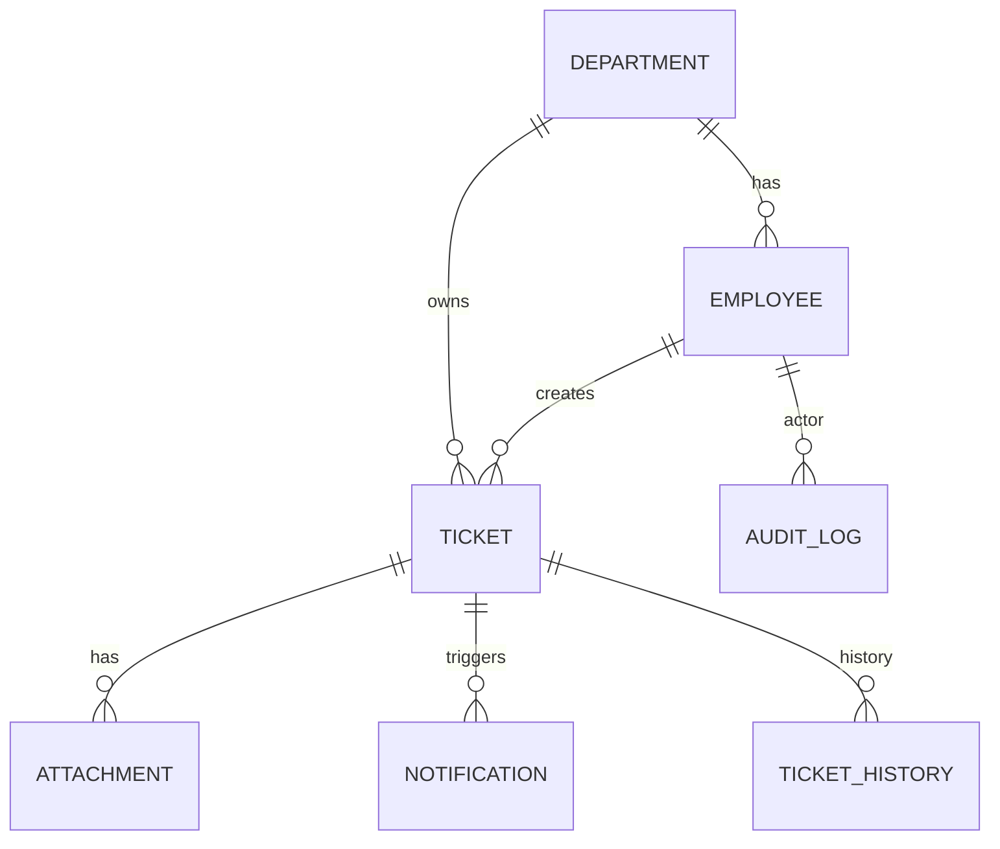

# Entity Relationship Diagram (ERD)

This document presents the proposed relational data model for migrating from client-side localStorage to a centralized database.

For full extended ERD (with forwarding, encryption flags, hash chain): see `diagrams/erd.mmd`.

## Design Notes
- Separation of `TICKET_HISTORY` from `AUDIT_LOG`: History is ticket-centric semantic changes, audit log is global security/trace record.
- `hash_chain_prev/hash_chain_curr` in `AUDIT_LOG` supports tamper-evident ledger.
- Attachments optionally encrypted (flag `encrypted`).
- Forwarding (in extended diagram) isolates cross-department routing metadata.

## Next Steps
1. Translate ERD into Prisma schema (or chosen migration tool).
2. Add indexes: `TICKET(status)`, `TICKET(department_id, created_at)`, `AUDIT_LOG(entity, entity_id, created_at)`.
3. Consider partitioning `AUDIT_LOG` if growth > 10M rows/year.
