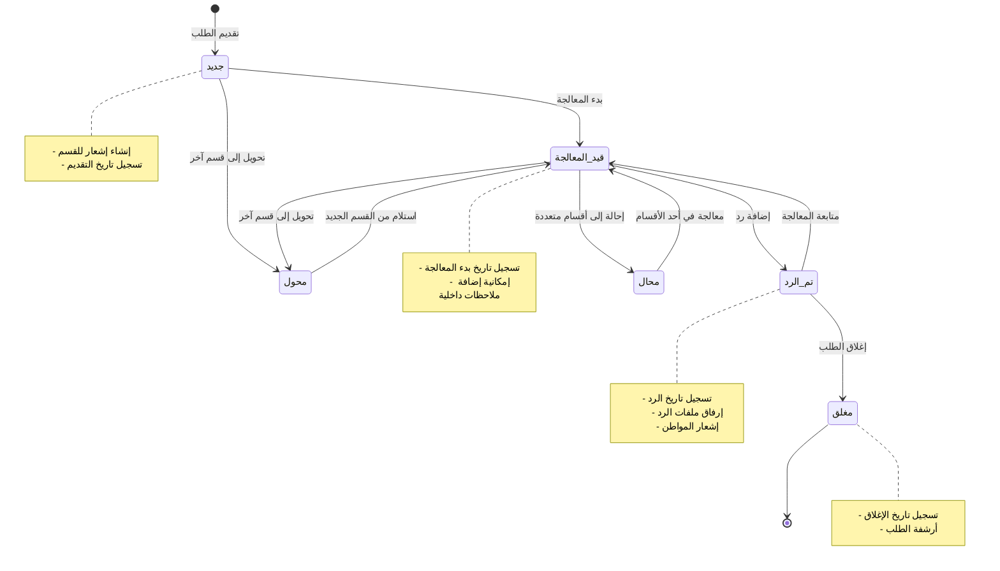
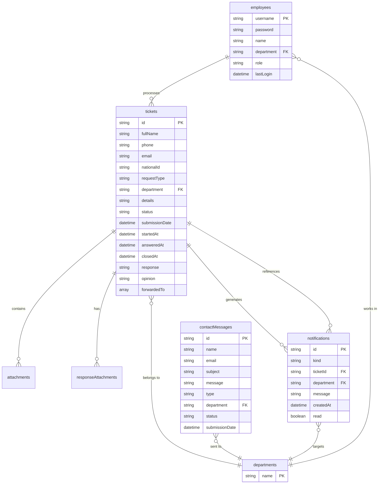

# مخطط التدفق الشامل لنظام الاستعلامات والشكاوى - مديرية مالية حلب

## مخطط التدفق الرئيسي للنظام

```mermaid
flowchart TD
    Start([بداية - دخول المستخدم للموقع]) --> UserType{نوع المستخدم}
    
    %% مسار المواطن
    UserType -->|مواطن| CitizenFlow[الصفحة الرئيسية للمواطنين]
    CitizenFlow --> CitizenActions{اختيار الإجراء}
    
    CitizenActions -->|تقديم طلب جديد| SubmitPage[صفحة تقديم الطلب]
    CitizenActions -->|متابعة طلب موجود| TrackPage[صفحة متابعة الطلب]
    CitizenActions -->|الأسئلة الشائعة| FAQPage[صفحة الأسئلة الشائعة]
    CitizenActions -->|تواصل معنا| ContactPage[صفحة التواصل]
    CitizenActions -->|الهيكل الإداري| DeptPage[صفحة الأقسام]
    
    %% تقديم الطلب
    SubmitPage --> FillForm[ملء نموذج الطلب]
    FillForm --> FormValidation{التحقق من صحة البيانات}
    FormValidation -->|بيانات صحيحة| GenerateID[إنشاء رقم الطلب]
    FormValidation -->|بيانات خاطئة| ShowError[عرض رسالة خطأ]
    ShowError --> FillForm
    
    GenerateID --> SaveToLocalStorage[(حفظ في localStorage)]
    SaveToLocalStorage --> CreateNotification[إنشاء إشعار للقسم المختص]
    CreateNotification --> ConfirmationPage[صفحة تأكيد الإرسال]
    
    %% متابعة الطلب
    TrackPage --> InputID[إدخال رقم الطلب]
    InputID --> SearchMethods{طريقة البحث}
    SearchMethods -->|إدخال يدوي| ManualSearch[بحث يدوي]
    SearchMethods -->|مسح QR Code| QRScan[مسح رمز QR]
    SearchMethods -->|رفع ملف PDF| PDFUpload[رفع ملف PDF]
    SearchMethods -->|OCR للصور| OCRScan[مسح النص من الصور]
    
    ManualSearch --> FindTicket{البحث عن الطلب}
    QRScan --> ExtractID[استخراج الرقم من QR]
    PDFUpload --> ExtractFromPDF[استخراج النص من PDF]
    OCRScan --> ExtractFromImage[استخراج النص بـ Tesseract]
    
    ExtractID --> FindTicket
    ExtractFromPDF --> FindTicket
    ExtractFromImage --> FindTicket
    
    FindTicket -->|تم العثور على الطلب| ShowTicketStatus[عرض حالة الطلب]
    FindTicket -->|لم يتم العثور| NotFoundMessage[رسالة عدم وجود الطلب]
    
    %% مسار الموظفين
    UserType -->|موظف| LoginCheck{هل سجل الدخول؟}
    LoginCheck -->|لا| LoginModal[نافذة تسجيل الدخول]
    LoginCheck -->|نعم| EmployeeDashboard[لوحة تحكم الموظف]
    
    LoginModal --> AuthValidation{التحقق من بيانات الدخول}
    AuthValidation -->|صحيحة| CheckRole{التحقق من الدور}
    AuthValidation -->|خاطئة| LoginError[رسالة خطأ تسجيل الدخول]
    LoginError --> LoginModal
    
    CheckRole -->|مدير| AdminDashboard[لوحة تحكم المدير]
    CheckRole -->|موظف| EmployeeDashboard
    
    %% لوحة تحكم الموظف
    EmployeeDashboard --> EmployeeActions{إجراءات الموظف}
    EmployeeActions -->|عرض الطلبات| ViewTickets[عرض طلبات القسم]
    EmployeeActions -->|إدارة الردود| ManageResponses[إدارة الردود]
    EmployeeActions -->|الديوان العام| DiwanPages[صفحات الديوان]
    EmployeeActions -->|الرسائل| MessagesPage[صفحة الرسائل]
    
    ViewTickets --> TicketActions{إجراءات الطلب}
    TicketActions -->|تغيير الحالة| ChangeStatus[تغيير حالة الطلب]
    TicketActions -->|إضافة رد| AddResponse[إضافة رد على الطلب]
    TicketActions -->|تحويل القسم| TransferDept[تحويل إلى قسم آخر]
    TicketActions -->|إحالة| ForwardTicket[إحالة إلى أقسام متعددة]
    
    ChangeStatus --> UpdateLocalStorage[(تحديث localStorage)]
    AddResponse --> UpdateLocalStorage
    TransferDept --> CreateTransferNotification[إنشاء إشعار التحويل]
    ForwardTicket --> CreateForwardNotification[إنشاء إشعار الإحالة]
    
    CreateTransferNotification --> UpdateLocalStorage
    CreateForwardNotification --> UpdateLocalStorage
    UpdateLocalStorage --> RefreshDashboard[تحديث لوحة التحكم]
    
    %% لوحة تحكم المدير
    AdminDashboard --> AdminActions{إجراءات المدير}
    AdminActions -->|جميع الطلبات| ViewAllTickets[عرض جميع الطلبات]
    AdminActions -->|إدارة الموظفين| EmployeeManagement[إدارة الموظفين]
    AdminActions -->|الأدوات| ToolsPage[صفحة الأدوات]
    AdminActions -->|مراقبة النظام| MonitorPage[صفحة المراقبة]
    AdminActions -->|الإحصائيات| Statistics[عرض الإحصائيات]
    
    %% صفحات الديوان
    DiwanPages --> DiwanSections{أقسام الديوان}
    DiwanSections -->|الديوان العام| GeneralDiwan[إدارة الوثائق والمراسلات]
    DiwanSections -->|ديوان الدخل| IncomeDiwan[إدارة ضرائب الدخل]
    DiwanSections -->|ديوان الواردات| ImportsDiwan[إدارة رسوم الاستيراد]
    DiwanSections -->|ديوان الخزينة| TreasuryDiwan[إدارة الخزينة]
    
    GeneralDiwan --> DiwanFeatures{ميزات الديوان}
    DiwanFeatures -->|صندوق الوارد| Inbox[إدارة الرسائل الواردة]
    DiwanFeatures -->|صندوق الصادر| Outbox[إدارة الرسائل الصادرة]
    DiwanFeatures -->|الأرشيف| Archive[أرشفة الوثائق]
    DiwanFeatures -->|البحث والدراسة| Research[قسم البحث والدراسة]
    
    %% معالجة البيانات
    UpdateLocalStorage --> DataProcessing{معالجة البيانات}
    DataProcessing -->|الطلبات| TicketData[(tickets)]
    DataProcessing -->|الموظفين| EmployeeData[(employees)]
    DataProcessing -->|الإشعارات| NotificationData[(notifications)]
    DataProcessing -->|الرسائل| ContactData[(contactMessages)]
    DataProcessing -->|الأقسام| DepartmentData[(departmentsList)]
    
    %% التكاملات الخارجية
    QRScan --> ZXingLib[مكتبة @zxing/browser]
    PDFUpload --> ReactPDFLib[مكتبة react-pdf]
    OCRScan --> TesseractLib[مكتبة Tesseract.js]
    
    %% إنتاج التقارير
    Statistics --> GenerateReports{إنتاج التقارير}
    GenerateReports -->|PDF| jsPDFLib[مكتبة jsPDF]
    GenerateReports -->|Excel| ExcelExport[تصدير Excel]
    GenerateReports -->|المخططات| MermaidCharts[مخططات Mermaid]
    
    %% الإعدادات والثيم
    Start --> ThemeCheck{نمط العرض}
    ThemeCheck -->|فاتح| LightTheme[النمط الفاتح]
    ThemeCheck -->|داكن| DarkTheme[النمط الداكن]
    
    %% نهاية التدفق
    ShowTicketStatus --> End([انتهاء الجلسة])
    RefreshDashboard --> End
    ConfirmationPage --> End
    NotFoundMessage --> TrackPage
    
    %% التنسيق
    classDef citizenClass fill:#e1f5fe,stroke:#01579b,stroke-width:2px
    classDef employeeClass fill:#e8f5e8,stroke:#2e7d32,stroke-width:2px
    classDef adminClass fill:#fff3e0,stroke:#ef6c00,stroke-width:2px
    classDef dataClass fill:#f3e5f5,stroke:#7b1fa2,stroke-width:2px
    classDef integrationClass fill:#ffebee,stroke:#c62828,stroke-width:2px
    
    class CitizenFlow,SubmitPage,TrackPage,FAQPage,ContactPage citizenClass
    class EmployeeDashboard,ViewTickets,ManageResponses,DiwanPages employeeClass
    class AdminDashboard,EmployeeManagement,ToolsPage,MonitorPage adminClass
    class TicketData,EmployeeData,NotificationData,ContactData,DepartmentData dataClass
    class ZXingLib,ReactPDFLib,TesseractLib,jsPDFLib integrationClass
```



## مخطط دورة حياة الطلب



## مخطط بنية البيانات في localStorage



## مخطط التكاملات الخارجية

```mermaid
graph LR
    App[تطبيق React] --> Context[AppContext]
    Context --> LocalStorage[(localStorage)]
    
    App --> UI{واجهة المستخدم}
    UI --> TailwindCSS[Tailwind CSS]
    UI --> ReactIcons[React Icons]
    UI --> ArabicFonts[الخطوط العربية]
    
    App --> Integrations{التكاملات}
    
    Integrations --> PDF{معالجة PDF}
    PDF --> ReactPDF[react-pdf]
    PDF --> jsPDF[jsPDF لإنتاج PDF]
    PDF --> svg2pdf[svg2pdf.js]
    
    Integrations --> QR{رموز QR والباركود}
    QR --> ZXing[@zxing/browser]
    QR --> jsQR[jsQR]
    
    Integrations --> OCR{استخراج النص}
    OCR --> Tesseract[Tesseract.js]
    
    Integrations --> Charts{المخططات}
    Charts --> Mermaid[Mermaid.js]
    
    Integrations --> Mobile{التطبيق المحمول}
    Mobile --> Capacitor[Capacitor]
    Mobile --> Android[Android App]
    
    Integrations --> Build{البناء والتطوير}
    Build --> Vite[Vite]
    Build --> TypeScript[TypeScript]
    
    LocalStorage --> DataKeys{مفاتيح البيانات}
    DataKeys --> tickets[(tickets)]
    DataKeys --> employees[(employees)]
    DataKeys --> notifications[(notifications)]
    DataKeys --> contactMessages[(contactMessages)]
    DataKeys --> departmentsList[(departmentsList)]
    DataKeys --> diwanDocs[(diwanDocs)]
    DataKeys --> customTemplates[(customTemplates)]
```

## دليل الاستخدام السريع

### للمواطنين:
1. **تقديم طلب جديد**: الصفحة الرئيسية → تقديم طلب → ملء البيانات → الحصول على رقم الطلب
2. **متابعة الطلب**: متابعة طلب → إدخال الرقم أو مسح QR → عرض الحالة

### للموظفين:
1. **تسجيل الدخول**: الضغط على "دخول الموظفين" → إدخال بيانات الاعتماد
2. **معالجة الطلبات**: لوحة التحكم → عرض الطلبات → اختيار الطلب → تغيير الحالة/إضافة رد

### للمدراء:
1. **عرض جميع الطلبات**: الدخول كمدير → لوحة التحكم → عرض جميع الطلبات
2. **إدارة الموظفين**: الأدوات → إدارة الموظفين → إضافة/تعديل/حذف
3. **الإحصائيات**: المراقبة → عرض إحصائيات النظام
